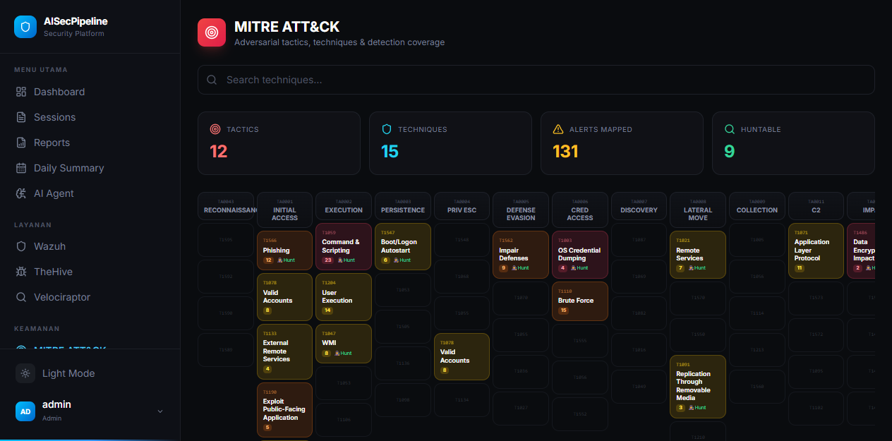

# AISecPipeline

AI-powered SOC dashboard — integrates Wazuh, Velociraptor, TheHive, and SOAR playbooks into one platform with **9 Router AI Agent** multi-model routing.


## Project Structure

```
AISecPipeline/
├── artifacts/
│   ├── dashboard/              # React frontend (Vite + TailwindCSS)
│   │   ├── src/
│   │   │   ├── pages/          # 25+ page components
│   │   │   │   ├── Agent.tsx           # 9 Router AI Agent console
│   │   │   │   ├── Dashboard.tsx       # Main overview with charts
│   │   │   │   ├── Wazuh.tsx           # Agent & event monitoring
│   │   │   │   ├── TheHive.tsx         # Incident case management
│   │   │   │   ├── Velociraptor.tsx    # Hunt & artifact collection
│   │   │   │   ├── Mitre.tsx           # MITRE ATT&CK matrix
│   │   │   │   ├── Playbooks.tsx       # SOAR automated playbooks
│   │   │   │   ├── AlertsPage.tsx      # Alert queue & triage
│   │   │   │   ├── Sessions.tsx        # Triage session management
│   │   │   │   ├── DailySummary.tsx    # AI-powered daily summary
│   │   │   │   ├── Reports.tsx         # AI analysis reports
│   │   │   │   ├── Login.tsx           # Authentication portal
│   │   │   │   ├── Settings.tsx        # System settings
│   │   │   │   ├── Users.tsx           # User management
│   │   │   │   ├── Connectors.tsx      # External integrations
│   │   │   │   └── Usage.tsx           # API usage stats
│   │   │   ├── components/     # Reusable UI components
│   │   │   ├── context/        # Auth & theme context
│   │   │   ├── hooks/          # Custom React hooks
│   │   │   └── index.css       # Dark cyber theme
│   │   └── ...
│   ├── api-server/             # Express.js backend
│   └── mockup-sandbox/         # Replit utilities
├── docker/
│   ├── Dockerfile.api
│   └── Dockerfile.frontend
├── lib/                        # Shared libraries
├── screenshots/                # UI screenshots
├── docker-compose.yml
├── .env.example
└── README.md
```

## Quick Start

### Prerequisites
- Docker & Docker Compose
- Node.js 18+ / pnpm (local dev)

### 1. Clone & Configure
```bash
git clone https://github.com/Alleyaaa/AISecPipeline.git
cd AISecPipeline
cp .env.example .env
# Edit .env with credentials
```

### 2. Run with Docker
```bash
docker compose up -d --build
```
Dashboard: `http://localhost:3000`  
API: `http://localhost:5000`

### 3. Default Login
**Username:** `admin`  
**Password:** `Vembazax26!`

---

## Screenshots

| Dashboard Overview | AI Agent — 9 Router |
|:---:|:---:|
|  |  |

| MITRE ATT&CK Matrix | Alert Queue |
|:---:|:---:|
|  |  |

---

## Features

### 🤖 AI Agent — 9 Router
- Multi-model routing (Llama 3.1, Mixtral, Qwen, DeepSeek)
- Real-time AI query console for SOC operations
- Automated malware analysis & log correlation
- YARA rule generation & threat hunting recommendations
- SOC query history with processing status

### 🔍 Real-time Monitoring
- **Dashboard**: Live threats, severity distribution, weekly trends, active source status
- **Wazuh Integration**: Agent health, real-time events, MITRE mapping
- **Velociraptor Hunts**: Artifact collection, query-based hunting, data export

### 🛡️ Incident Response
- **TheHive Incidents**: Case management with severity, TLP, assignee tracking
- **Alert Triage**: Filterable queue, scoring, MITRE mapping, status workflow
- **SOAR Playbooks**: Automated response, connector status dashboard, integration wizards

### 🎯 MITRE ATT&CK
- Complete 12-tactic matrix with detection coverage per technique
- Alert correlation with MITRE IDs
- Velociraptor hunt availability indicators
- Search across all techniques

### 📊 Security Analytics
- AI Analysis Reports with severity distribution
- **Daily Security Summary**: KPI metrics, incident timeline, AI agent decisions, severity breakdown
- **Triage Sessions**: New session creation, filterable table, progress tracking, 9 Router integration

---

## Usage Guide

### Dashboard Workflow
1. **Dashboard**: Check active threats, weekly trends, recent alerts
2. **AI Agent**: Query models via console for analysis/correlation
3. **Alerts**: Triage incoming alerts, filter by severity, investigate
4. **Sessions**: Create investigation sessions, track progress, assign AI agents
5. **Daily Summary**: Review daily digest with AI agent decisions
6. **MITRE ATT&CK**: Cross-reference techniques with alert coverage
7. **Wazuh / Velociraptor / TheHive**: Deep-dive per data source
8. **SOAR Playbooks**: Trigger automated response workflows

### Connecting Real Tools (Self-Hosted)
1. Open **SOAR Playbooks → Connector Setup** tab
2. Configure each connector:
   - **Wazuh**: Point to Wazuh manager API (`https://wazuh:55000`)
   - **TheHive**: TheHive instance API (`https://thehive:9000`)
   - **Velociraptor**: GRPC API endpoint (`https://velociraptor:8000`)
3. Update credentials in **Settings** page
4. Once connected, playbooks auto-trigger on alerts from the AI Agent

### 9 Router AI Setup
The 9 Router AI Agent is built-in with 4 pre-configured models:
- **Llama 3.1 70B**: General analysis & correlation
- **Mixtral 8x22B**: Fast triage & classification
- **Qwen 2.5 32B**: Log parsing & pattern detection
- **DeepSeek Coder V2**: YARA/sigma rule generation
- Route tasks automatically or manually select the optimal model

### Environment Variables
| Variable | Description | Required |
|----------|-------------|----------|
| `DATABASE_URL` | PostgreSQL connection string | Yes |
| `JWT_SECRET` | JWT signing secret | Yes |
| `WAZUH_API_URL` | Wazuh manager URL | No |
| `THEHIVE_API_KEY` | TheHive API key | No |
| `VELOCIRAPTOR_API_KEY` | Velociraptor API key | No |

---

## License
MIT
