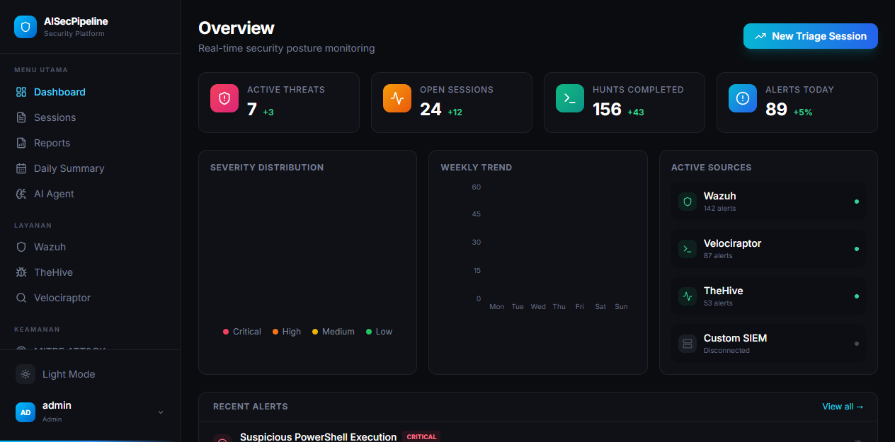
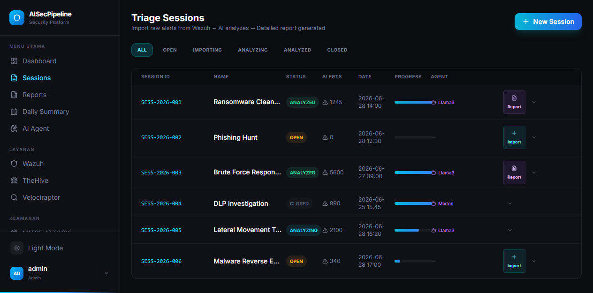
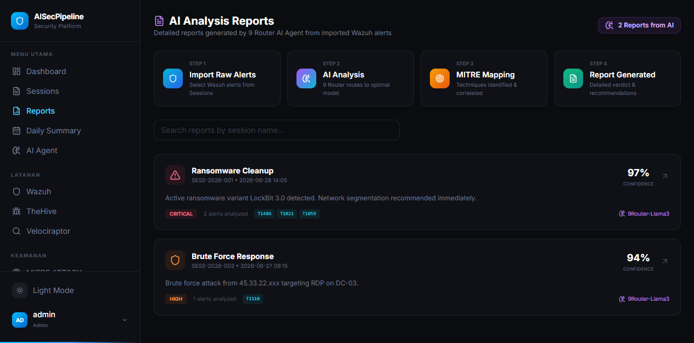
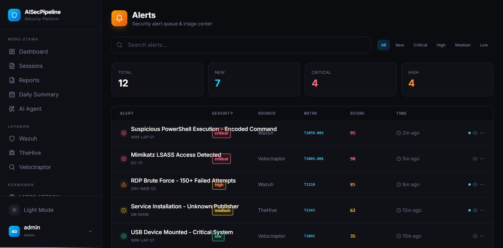
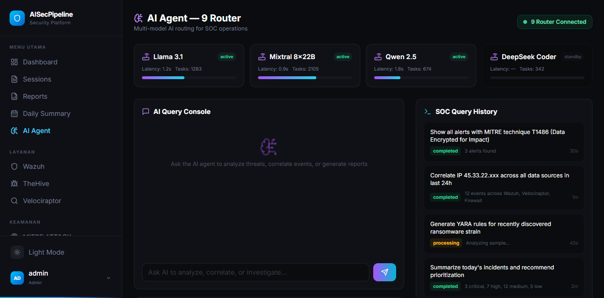

# AISecPipeline

AI-powered SOC dashboard — integrates Wazuh, Velociraptor, TheHive, and SOAR playbooks with **9 Router AI Agent** multi-model routing.

## Dashboard Overview



## How It Works (Data Flow)

```
┌─────────────────────────────────────────────────────────────────────────┐
│ 1. RAW ALERTS (Wazuh)                                                  │
│    Suspicious PowerShell, Mimikatz, RDP Brute Force, Malicious DLL    │
└────────────────────────┬────────────────────────────────────────────────┘
                         ▼
┌─────────────────────────────────────────────────────────────────────────┐
│ 2. TRIAGE SESSIONS                                                     │
│    ← Import raw alerts from Wazuh into a new session                    │
│    ← Select specific alerts to analyze                                  │
│    ← Or create session + import directly                                │
└────────────────────────┬────────────────────────────────────────────────┘
                         ▼
┌─────────────────────────────────────────────────────────────────────────┐
│ 3. 9 ROUTER AI AGENT                                                   │
│    ┌────────────┐  ┌────────────┐  ┌────────────┐  ┌────────────┐     │
│    │Llama 3.1   │  │Mixtral     │  │Qwen 2.5    │  │DeepSeek    │     │
│    │70B (Gen)   │  │8x22B (Fast)│  │32B (Logs)  │  │Coder (YARA)│     │
│    └────────────┘  └────────────┘  └────────────┘  └────────────┘     │
│    ← Auto-routes to optimal model based on alert type                   │
│    ← AI correlates alerts, maps MITRE techniques, generates analysis    │
└────────────────────────┬────────────────────────────────────────────────┘
                         ▼
┌─────────────────────────────────────────────────────────────────────────┐
│ 4. ANALYSIS REPORT                                                     │
│    ← Summary & Verdict                                                  │
│    ← MITRE ATT&CK mapping                                              │
│    ← Confidence scoring                                                │
│    ← Actionable recommendations                                        │
└────────────────────────┬────────────────────────────────────────────────┘
                         ▼
┌─────────────────────────────────────────────────────────────────────────┐
│ 5. SOAR PLAYBOOKS (Optional Automation)                                │
│    ← Auto-block IP at firewall                                          │
│    ← Isolate compromised endpoints                                      │
│    ← Deploy YARA rules                                                  │
│    ← Create TheHive cases                                               │
└─────────────────────────────────────────────────────────────────────────┘
```

## Project Structure

```
AISecPipeline/
├── artifacts/
│   ├── dashboard/              # React frontend (Vite + TailwindCSS)
│   │   ├── src/
│   │   │   ├── pages/          # 25+ page components
│   │   │   │   ├── Agent.tsx           # 9 Router AI Agent console
│   │   │   │   ├── Dashboard.tsx       # Main overview with charts
│   │   │   │   ├── Sessions.tsx        # Import Wazuh alerts → AI analyze
│   │   │   │   ├── Reports.tsx         # AI analysis reports detail
│   │   │   │   ├── ReportDetail.tsx    # Single report view
│   │   │   │   ├── DailySummary.tsx    # AI-powered daily security digest
│   │   │   │   ├── Wazuh.tsx           # Agent & event monitoring
│   │   │   │   ├── TheHive.tsx         # Incident case management
│   │   │   │   ├── Velociraptor.tsx    # Hunt & artifact collection
│   │   │   │   ├── Mitre.tsx           # MITRE ATT&CK matrix
│   │   │   │   ├── Playbooks.tsx       # SOAR automated playbooks
│   │   │   │   ├── AlertsPage.tsx      # Alert queue & triage
│   │   │   │   ├── Login.tsx           # Authentication portal
│   │   │   │   └── ...                 # Settings, Users, Connectors
│   │   │   ├── components/     # Reusable UI components (sidebar, cards)
│   │   │   ├── context/        # Auth & theme context
│   │   │   └── index.css       # Dark cyber theme
│   │   └── ...
│   ├── api-server/             # Express.js backend (Drizzle + PostgreSQL)
│   └── mockup-sandbox/         # Replit utilities
├── docker/
│   ├── Dockerfile.api
│   └── Dockerfile.frontend
├── lib/                        # Shared libraries (db, api-zod, api-client)
├── screenshots/                # UI screenshots
├── docker-compose.yml
├── .env.example
└── README.md
```

## Quick Start

### Prerequisites
- Docker & Docker Compose
- Node.js 18+ / pnpm (local dev)

### 1. Clone & Configure
```bash
git clone https://github.com/Alleyaaa/AISecPipeline.git
cd AISecPipeline
cp .env.example .env
# Edit .env with your credentials
```

### 2. Run with Docker
```bash
docker compose up -d --build
```
Dashboard: `http://localhost:3000`  
API: `http://localhost:5000`

### 3. Default Login
**Username:** `admin`  
**Password:** `Vembazax26!`

---

## Screenshots

| **Dashboard** | **Triage Sessions** |
|:---:|:---:|
|  |  |
| Real-time threat overview, severity distribution, weekly trends | Import raw Wazuh alerts → AI analyzes → detailed report |

| **AI Analysis Reports** | **Alert Queue** |
|:---:|:---:|
|  |  |
| AI-generated reports with MITRE mapping & recommendations | Triage alerts, filter by severity, investigate incidents |

| **AI Agent — 9 Router** |
|:---:|
|  |
| Multi-model AI console: query, correlate, and analyze across 4 models |

---

## Features

### 🤖 AI Agent — 9 Router
- **Multi-model routing** — Llama 3.1 70B, Mixtral 8x22B, Qwen 2.5 32B, DeepSeek Coder V2
- Real-time AI query console for SOC operations
- Automated malware analysis, log correlation, threat hunting recommendations
- YARA/sigma rule generation
- Dynamic report generation per session

### 🔄 Core Workflow: Alert → AI → Report
1. **Wazuh Alerts**: Raw endpoint telemetry (Suspicious PowerShell, Mimikatz, Brute Force, etc.)
2. **Import to Session**: Select alerts from the pre-populated Wazuh data pool
3. **9 Router AI Analysis**: Auto-routes to optimal model based on alert type and severity
4. **Detailed Report**: Summary, verdict, MITRE mapping, confidence scoring, actionable recommendations
5. **Export & Act**: PDF export, SOAR playbook triggers

### 🔍 Real-time Monitoring
- **Dashboard**: Live threats, severity distribution, weekly trends, active source status
- **Wazuh Integration**: Agent health, real-time events, rule correlation, MITRE mapping
- **Velociraptor Hunts**: Artifact collection, query-based hunting, data export
- **TheHive Incidents**: Case management with severity, TLP, assignee tracking

### 🛡️ Security Operations
- **Alert Triage**: Filterable queue with scoring, MITRE mapping, status workflow
- **Daily Summary**: AI-generated daily digest with KPI metrics, incident timeline, agent decisions
- **SOAR Playbooks**: Automated response steps, connector status dashboard, integration wizards

### 🎯 MITRE ATT&CK
- Complete 12-tactic matrix with detection coverage per technique
- Alert correlation with MITRE IDs
- Velociraptor hunt availability indicators
- Technique search across all 200+ tactics

### 📊 Reports & Analytics
- **AI Analysis Reports**: Each session generates a structured report with:
  - Executive summary & verdict
  - MITRE ATT&CK technique mapping
  - Confidence scoring (97%+ for critical threats)
  - Prioritized remediation recommendations
  - AI model attribution
- **Daily Summary**: KPI cards, incident timeline, AI agent decisions, severity breakdown

---

## Usage Guide

### Full SOC Workflow

#### Phase 1: Monitor
```
Dashboard → Check active threats & alerts → Identify incidents
```

#### Phase 2: Investigate
```
1. Create a Session → Give it a name (e.g. "Ransomware Investigation")
2. Click "Import" → Select raw Wazuh alerts related to the incident
3. Click "Analyze with AI" → 9 Router routes to optimal model
4. AI generates: MITRE mapping + confidence score + recommendations
5. View report → Click "Report" on the session
```

#### Phase 3: Respond
```
1. Review AI recommendations (block IPs, isolate hosts, reset credentials)
2. Use SOAR Playbooks to automate response
3. Update session status to "Closed" after remediation
```

#### Phase 4: Document
```
1. Export PDF report for compliance/audit
2. Daily Summary captures key SOC metrics and decisions
```

### 9 Router AI Agent
- **Console**: Type natural language queries (e.g., "Show all alerts with MITRE T1486")
- **Model Routing**: Automatic — Llama 3.1 for complex analysis, Mixtral for fast triage, Qwen for log parsing, DeepSeek for YARA rules
- **Query History**: All past queries visible with execution status

### Connecting Real Tools (Self-Hosted)
| Tool | Endpoint | Config Location |
|------|----------|----------------|
| Wazuh | `https://wazuh-manager:55000` | `.env` / Settings |
| TheHive | `https://thehive:9000` | `.env` / Settings |
| Velociraptor | `grpc://velociraptor:8000` | `.env` / Settings |

### Environment Variables
| Variable | Description | Required |
|----------|-------------|----------|
| `DATABASE_URL` | PostgreSQL connection string | Yes |
| `JWT_SECRET` | JWT signing secret | Yes |
| `WAZUH_API_URL` | Wazuh manager URL | No |
| `THEHIVE_API_KEY` | TheHive API key | No |
| `VELOCIRAPTOR_API_KEY` | Velociraptor API key | No |

---

## Tech Stack
- **Frontend**: Vite + React 18 + TypeScript + TailwindCSS
- **Backend**: Express.js + Drizzle ORM + PostgreSQL
- **AI Routing**: 9 Router (Llama 3.1, Mixtral, Qwen, DeepSeek)
- **Containerization**: Docker + Docker Compose (multi-stage builds)
- **Package Manager**: pnpm (monorepo workspace)

## License
MIT
